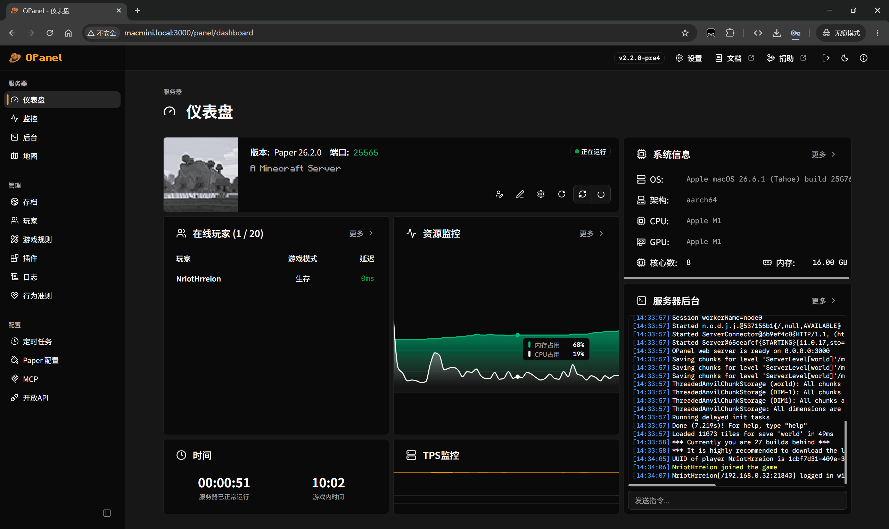
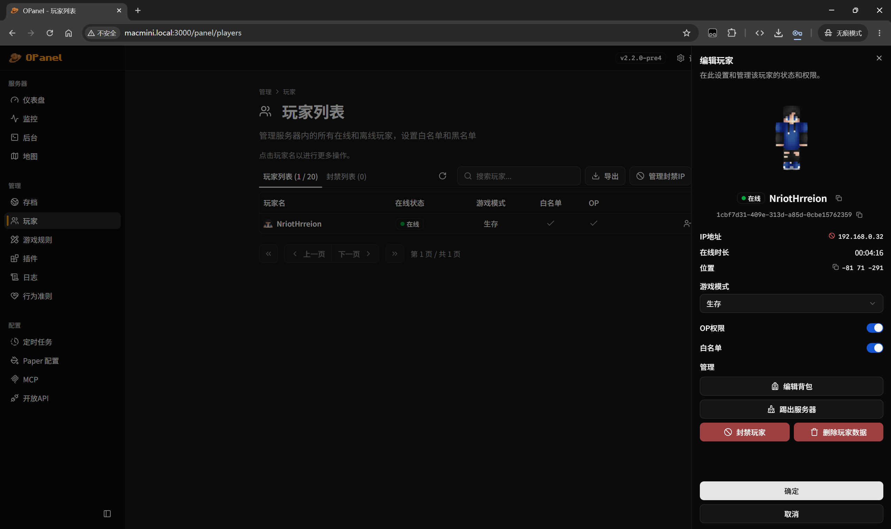
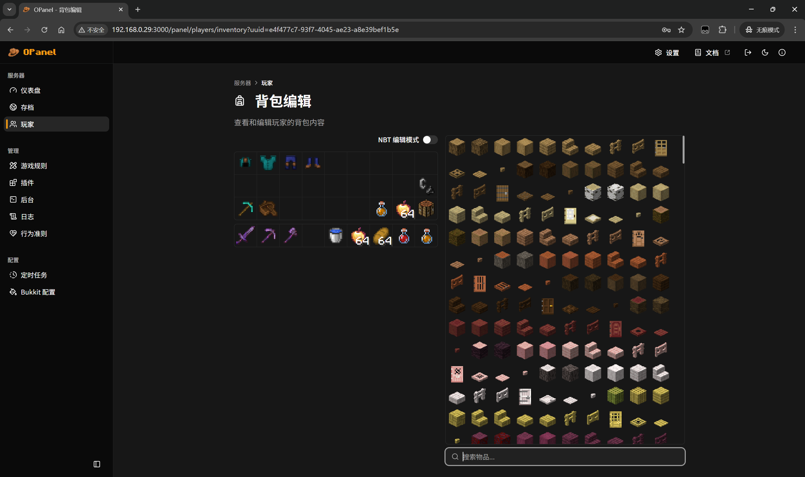
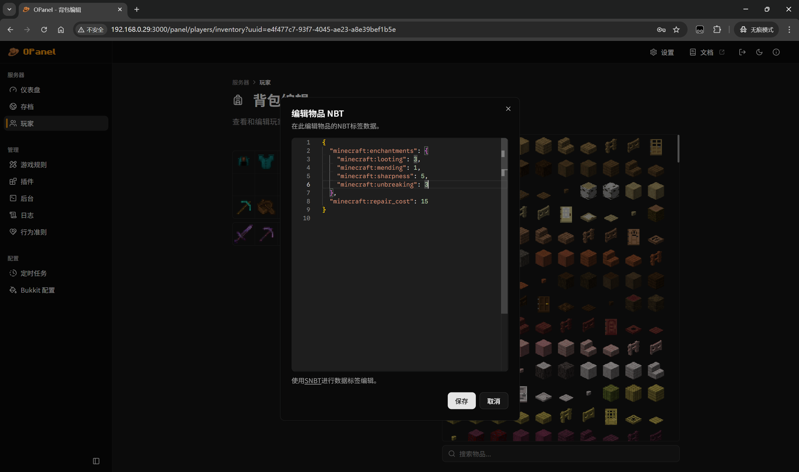
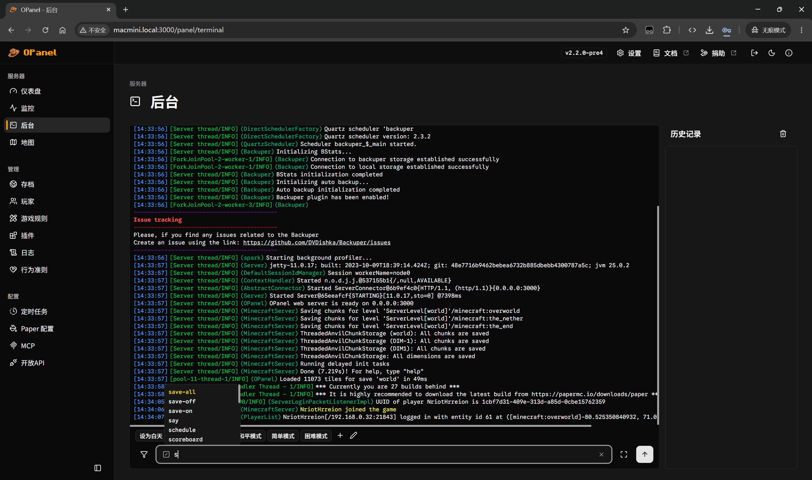
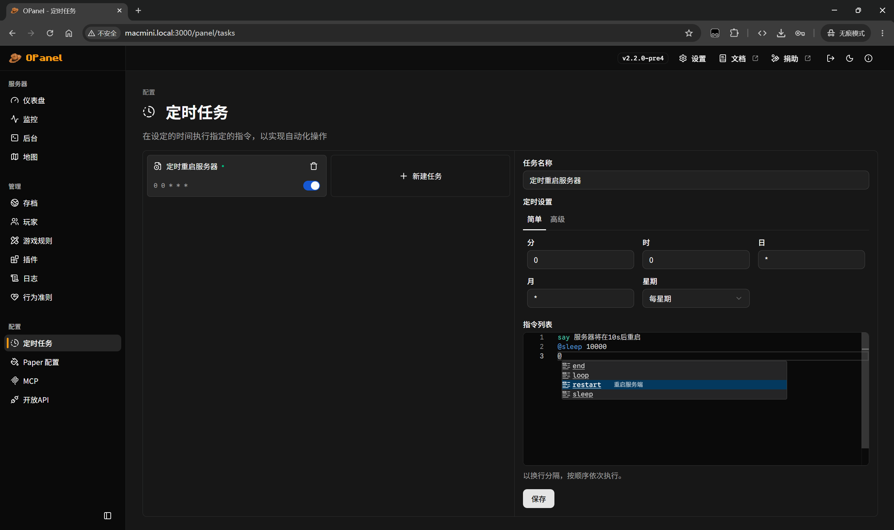
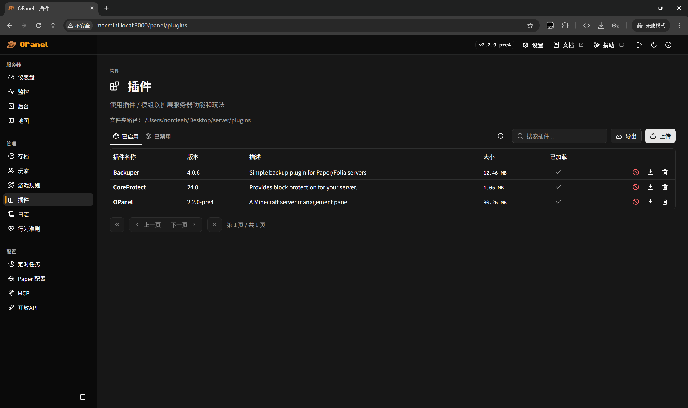

<div align="center">


<br>
<br>

[](https://github.com/opanel-mc/opanel/actions/workflows/build.yml)
[](./LICENSE)
[](https://github.com/opanel-mc/opanel/stargazers)

> Minecraft 服务器管理面板

[English](README.md) | 中文

</div>

## 简介

OPanel 是一个为 Minecraft 服务器管理员制作的管理面板，它以服务端插件的形式运行，支持 Paper、Leaves、Folia、Fabric、Forge 和 NeoForge 服务器。通过网页端面板，您可以以更可靠、直观和简便的方式管理您的服务器！

### 功能特性

OPanel 的功能包括：

- 仪表盘：提供服务器的全面概览
- 存档管理：帮助您通过简单的界面轻松上传、下载、删除或启用世界存档
- 玩家管理：帮助您管理玩家、封禁玩家和白名单，并执行踢出、封禁或更改权限等操作
- 游戏规则编辑器：帮助您无需输入任何命令即可编辑游戏规则
- 插件管理器：帮助您启用 / 禁用插件或模组，或查看插件的详细信息
- 终端控制台：可以直接从 Web 面板发送消息或执行命令
- 内置实时地图查看器
- 服务器日志管理器和查看器
- MCP 服务器: 通过[OPanel MCP](https://github.com/opanel-mc/opanel-mcp)，您可以使用AI智能体助手 (如 Claude Code, OpenClaw) 来管理您的服务器
- 开放 API: 您可以通过配置 OPanel 的开放 API，在服务器官网展示实时服务器状态和数据

### 支持语言

中文（包括简体，繁体，粤语），英语，日语，法语，德语，韩语

## 用法

请阅读[快速开始](https://opanel.cn/docs/quick-start)。

### 使用 AI 智能体开发扩展

如果你想使用 AI 智能体来快速开发一个 OPanel 扩展，也可以安装使用 OPanel 提供的 [Agent Skill](https://agentskills.io/home)。

```shell
npx skills add opanel-mc/opanel
```

## 截图















## 扩展

OPanel 扩展可以在不修改 OPanel 本体的情况下添加自定义后端 API、面板页面和事件监听来延申 OPanel 的功能。请阅读[扩展开发指南](https://opanel.cn/docs/extension)以开始开发。

## 贡献

查看[贡献指南](https://opanel.cn/docs/contributing)以了解更多信息。

## 友情链接

[](https://rainyun.com/opanel_)

## Star 历史曲线

[](https://www.star-history.com/?type=date&legend=top-left&repos=opanel-mc%2Fopanel)

## 许可

[GPL-3.0](./LICENSE)

[Third Party Notices](./ThirdPartyNotices.txt)
