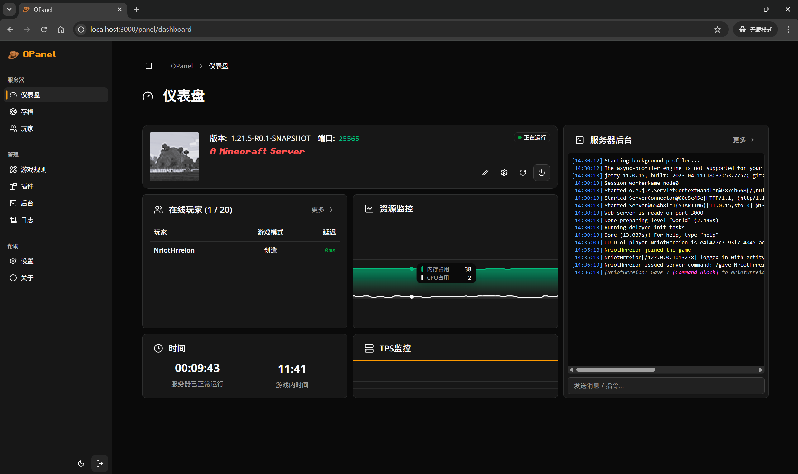
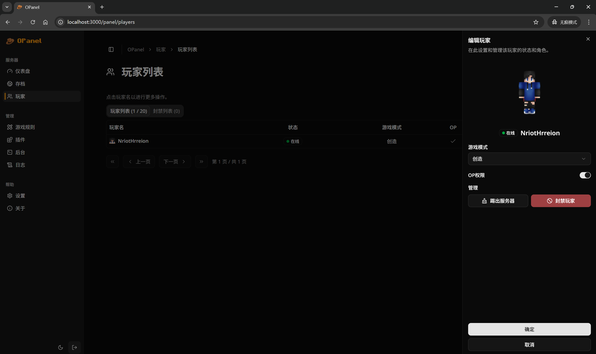
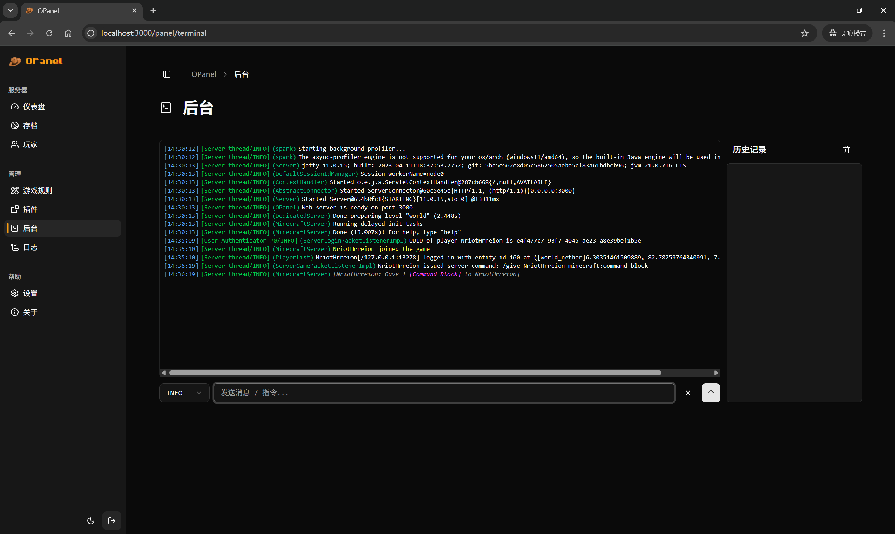

 
 

> A Minecraft server management panel

## Description

OPanel is a management panel for Minecraft server administrators, and it comes as a server-side plugin that can be run on Bukkit, Spigot, Paper, Fabric, Forge and Neoforge servers. With the web panel, you can manage your server in a more reliable, intuitive and simple way!

### Features

The feature of OPanel includes:

- Dashboard that provides a comprehensive overview of the server
- Saves manager that helps you easily upload, download, delete or enable your saves through a simple interface.
- Players manager that helps you manage players, banned players and whitelist, and perform actions like kick, ban or changing permissions.
- Gamerules editor that assists you to toggle gamerules without entering any command.
- Plugins manager. (In plan)
- Server terminal that can directly send messages or execute commands from the web panel.
- Server logs manager and viewer.

### Supported platforms and versions

The following target platforms and minecraft versions are supported:

|Server Type|Version|
|---|---|
|Bukkit / Spigot / Paper|>=1.20|
|Fabric|1.20.1, >=1.21|
|Forge|1.21-1.21.1, >=1.21.3|
|Neoforge|>=1.21.5|

### Screenshots

## Usage

Just simply download the corresponding jar file from [releases](https://github.com/nocpiun/opanel/releases), and drag it into your plugins / mods folder. After starting your server, you can access the web panel by `localhost:3000`.

### Configuration

You can configure OPanel through the config file generated inside your server folder.

- `accessKey`: The access key that you use to access the web panel. _(Default: "123456")_
- `salt`: The salt used when generating tokens. _(Default: "opanel")_
- `webServerPort`: The port of the web panel. _(Default: 3000)_

## Contributing

See [Contributing Guidelines](./CONTRIBUTING.md) for more information.

## Friend Links

## License

[MPL-2.0](./LICENSE)
